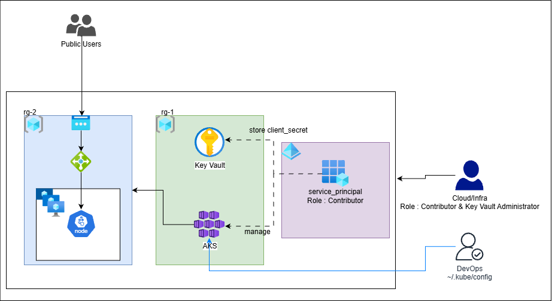

# 🚀 Azure DevOps Project 1: Infrastructure Automation & CI/CD 

## 📌 Project Overview
This repository demonstrates a production-ready **Infrastructure as Code (IaC)** workflow to provision an **Azure Kubernetes Service (AKS)** cluster using **Terraform**. 

The project emphasizes **Enterprise Security Standards** by automating the creation of a Service Principal (SPN) and integrating **Azure Key Vault** to store sensitive credentials. This approach ensures that no secrets are hardcoded in the source code or stored in unencrypted local files.

---

## 🛠️ Technical Ecosystem
| Category | Tools & Services |
| :--- | :--- |
| **Cloud Provider** | Microsoft Azure |
| **IaC** | Terraform / Bicep |
| **Orchestration** | Azure Kubernetes Service (AKS) |
| **Security** | Azure Key Vault, RBAC, 

---

## 🏗️ Implementation

### 1. Initialize Terraform
* Initialize the working directory and download the required providers (AzureRM, AzureAD).
'
terraform init
'

### 2. Plan the Infrastructure
* Generate an execution plan to preview the resources that will be created.
'
terraform plan
'

### 3. Apply Changes
* Deploy the infrastructure to Microsoft Azure.
'
terraform apply --auto-approve
'

## :white_check_mark: Verification
* Once the process is complete, follow these steps to verify the deployment:
### 1. Verify Secret in Key Vault
* Confirm that the Service Principal secret was successfully stored:
'
az keyvault secret list --vault-name <your-vault-name>
'

### 2. Connect to the Cluster
* Download the kubeconfig file to connect via kubectl:

' az aks get-credentials --resource-group <rg-name> --name <cluster-name>
'

### 3. Check Node Status
* Ensure the worker nodes are up and running:

'
kubectl get nodes
'

