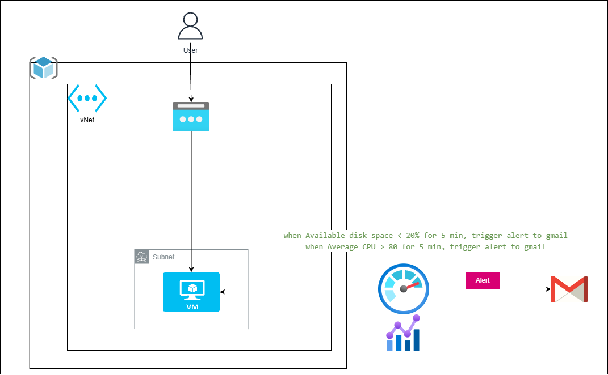

# Project 8: Linux VM Deployment with Azure Monitor Alerts

This project automates the deployment of a secure Ubuntu Linux Virtual Machine and implements a comprehensive **Monitoring and Alerting** strategy. It ensures that administrators are proactively notified via email if the system hits performance bottlenecks.



## 🚀 Key Features
- **Automated Linux VM:** Provisions a `Standard_B1s` Ubuntu instance with automated SSH key generation.
- **Dynamic Networking:** Sets up a dedicated VNet, Subnet, and Public IP for external access.
- **Security-First:** Implements a Network Security Group (NSG) that strictly limits inbound traffic to **SSH (22)** and **HTTP (80)**.
- **Proactive Monitoring:** - **CPU Alert:** Triggers if average CPU usage exceeds 80%.
    - **Memory Alert:** Triggers if available memory drops below a specific threshold.
- **Automated Notifications:** Configures an **Azure Action Group** to send email alerts to the specified administrator when metrics are breached.

## 🏗️ Technical Resources
- `azurerm_linux_virtual_machine`: The core compute resource.
- `azurerm_monitor_metric_alert`: Logic for monitoring "Percentage CPU" and "Available Memory Bytes".
- `azurerm_monitor_action_group`: The notification engine (Email receiver).
- `tls_private_key`: Used to generate secure SSH credentials on-the-fly.

## 🛠 Usage
1. **Configure Variables:** Set your `email_address`, `proj`, and `env` in your `terraform.tfvars`.
2. **Initialize:** 
```bash
   terraform init
```

3. **Deploy:** 
```bash
terraform apply --auto-approve
```

4. **Test Alerts:**
 You can simulate high CPU load on the VM using the stress tool to verify you receive the email notification.